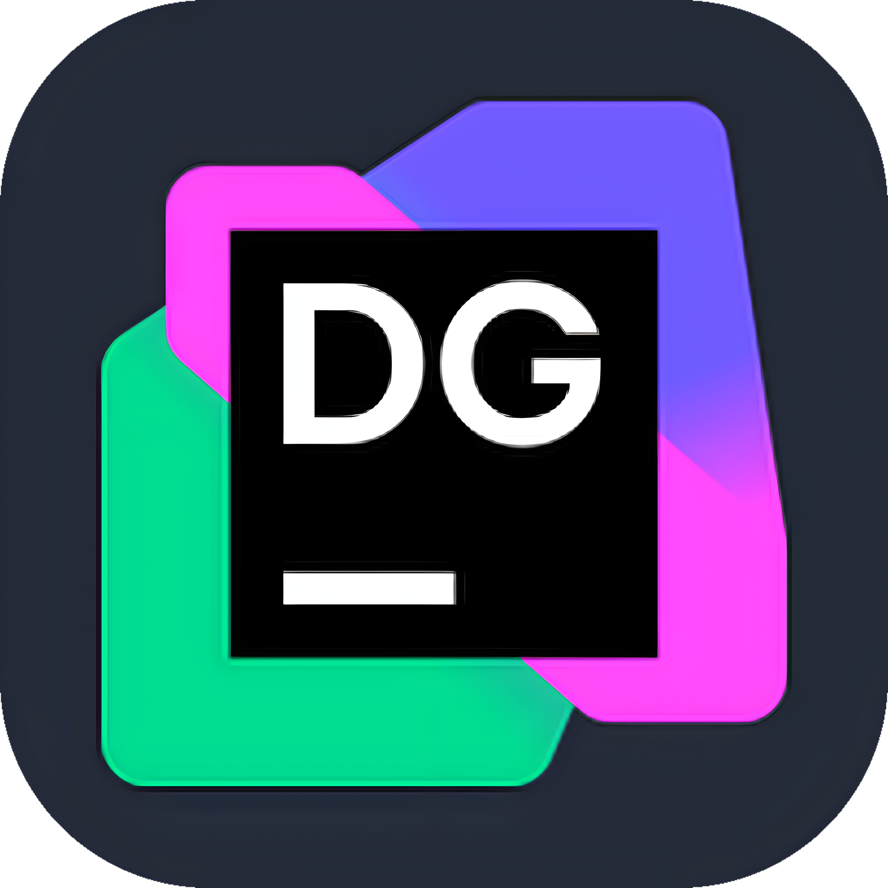

  

  <picture>
    <source media="(prefers-color-scheme: dark)" srcset="assets/name-dark.png">
    <source media="(prefers-color-scheme: light)" srcset="assets/name-light.png">
    
  </picture>

  <strong>B.Sc. Engineering Student in Computer Science & Engineering</strong> 
  Dhaka, Bangladesh 
  🌱 Learning, building, documenting, and growing as I develop my skills in technology.

---

### About Me

- **Education:** B.Sc. Engineering in Computer Science & Engineering
- **Learning:** OOP, DSA, DBMS, SDP, Git & GitHub
- **Working On:** Software Development Projects
- **Exploring:** Software Development and related technologies
- **Hobbies:** Music, Photography, Gym, Drawing, Reading, Anime & Open World Games

### Featured Projects

Here are some projects that I have recently worked on:

| Project Name               | Description                                                                                   | Tech Stack      | Link                                                                                         |
| :------------------------- | :-------------------------------------------------------------------------------------------- | :-------------- | :------------------------------------------------------------------------------------------- |
| **Study Planner App**      | A department-based study planner app for students.                                            | `Java` `JavaFX` | [View Repo](https://github.com/rezwan-ahmed-l7/Study-Planner-App)                            |
| **Bank Management System** | A modular Python banking system implementing basic account management and banking operations. | `Python`        | [View Repo](https://github.com/rezwan-ahmed-l7/Python-Programing/tree/main/Python%20Project) |
| **Railway Gate System**    | A smart railway gate management system.                                                       | `C++` `ESP32`   | [View Repo](https://github.com/rezwan-ahmed-l7/Smart-Raiway-Gate-System)                     |

---

### Let's Connect

  <strong>Feel free to explore my repositories and follow my journey.</strong>

---

   
  
  
   
  <h3>Skills & Tools</h3>

  

  

  

  

